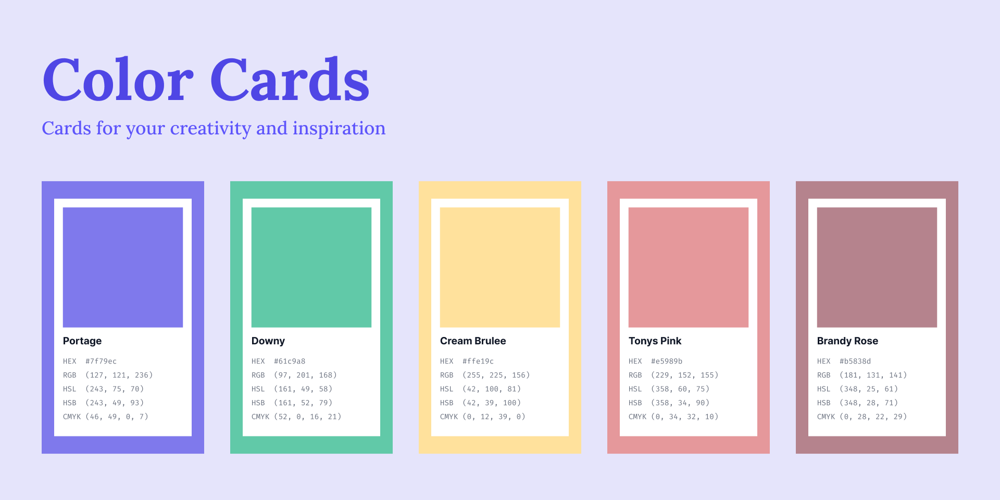

# Color Cards

## Description
Add color cards to your figma designs. This allows you to build a pallete or showcase colors for inspiration. You can generate custom names using "The Color API" for easily adding your new colors to your library.

## How to Use

The steps to using the plugin are straight forward:

1. **Select the color you want to use.** You can use the dropdown above the color input to change the color code input and type out your code. You could also use the color swatch to select a color in a more visual way. Your colors will be kept in sync!
2. **Select your size.** When you select a size other then default, the card will be scaled up or down. This is as if you were using the Scale tool in Figma. Below, is a table that shows you the scaling values used.
3. **Select your codes.** The codes that you check will be added to the card.
4. **Use a custom name.** Check "Use Custom Name" to name your card. By default, the plugin uses the [Color API](https://www.thecolorapi.com/) so you don't have to worry about coming up with a name.
5. Click "Create" to make your new card!

### Size Scaling

These are the values used when scaling the default card up or down.

| Size     | Scale |
| -------- | ----- |
| Small    | 0.8x  |
| Large    | 1.2x  |
| x-Large  | 1.4x  |
| 2x-Large | 1.6x  |

### Additional

All inputs are setup to keep the values you input within a valid range. Invalid characters are set to `0`.

## Tags
- color
- colors
- color cards
- color pallete
- inspiration
- design
